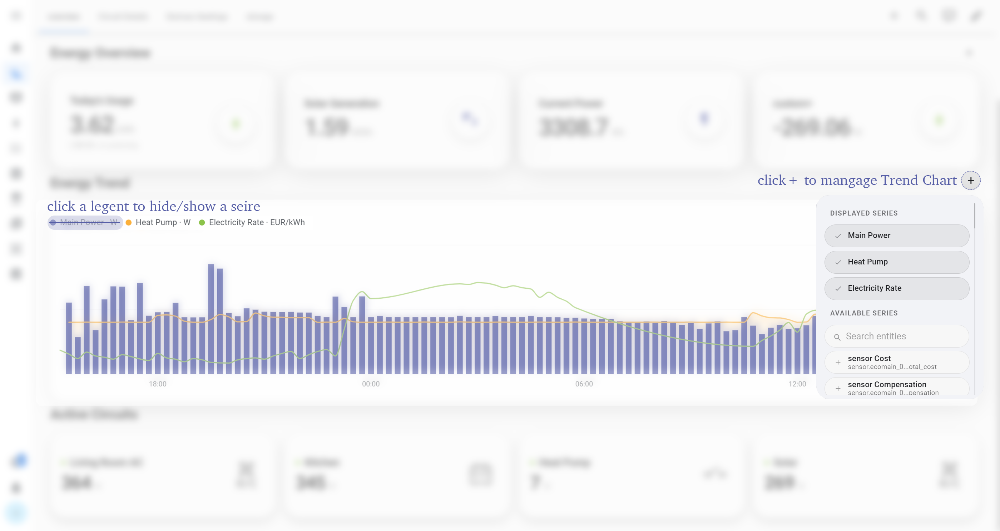
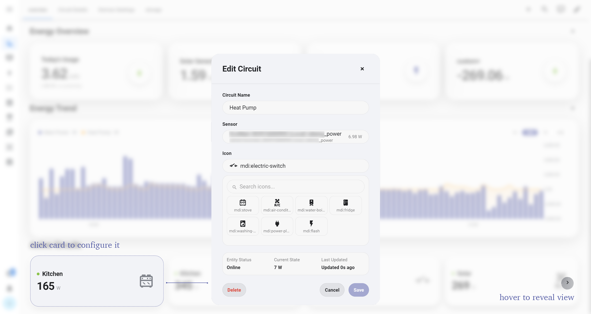
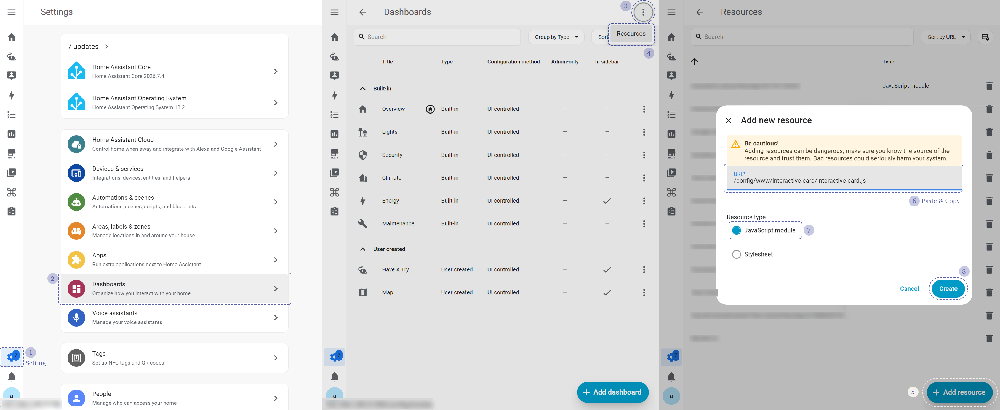

# Interactive Card

[English](./README.md) | [简体中文](./README_CN.md)

Interactive Card is a collection of Lovelace custom cards designed for Home Assistant energy dashboards.

The project started as a way to organize several reusable cards from a personal energy dashboard. As more features were added, it gradually evolved into a lightweight component library covering KPI data visualization, historical trend analysis, and real-time circuit power monitoring.

All cards share a consistent visual design system and can be flexibly configured using different Home Assistant entities, helping users better understand and manage their home energy data.

<p align="center">
  
</p>

## Features

Interactive Card currently includes three main components:

- **KPI** — Display key energy metrics such as consumption, power, and cost
- **Trend** — Analyze historical data with configurable data series
- **Circuit** — Monitor real-time power status of individual circuits

Supported features:

- Flexible Home Assistant entity selection
- Custom card titles, icons, units, decimal places, and KPI descriptions
- Automatic power and energy unit conversion and scaling
- Multiple trend series with Line, Area, and Bar chart modes
- Automatic, left, and right Y-axis configuration
- Adjustable trend resolution, time range, and chart height
- Custom circuit names, real-time power entities, and device icons
- Browser-local configuration persistence for dashboard edits
- Three visual styles: Glass, Native, and Solid
- Responsive layouts for KPI and circuit cards across different screen sizes


## Screenshots

### KPI

KPI cards can be added, removed, and edited directly from the dashboard.

Users can select the displayed entity and customize the title, unit, decimal places, and subtitle information.

<p align="center">
  
</p>


### Trend

The Trend card is designed to visualize how energy data changes over time.

It supports multiple data series displayed together, with the ability to quickly hide or show individual curves by clicking the legend.

<p align="center">
  
</p>

<p align="center">
  
</p>

Each Series can be configured independently, including display name, unit, chart type, axis position, and decimal places.

Since Home Assistant sensors may have different sampling frequencies, displaying raw data directly can introduce excessive short-term fluctuations.

The Trend card therefore uses smoothing by default to provide a clearer view of overall changes, while also supporting a high-precision mode for users who need detailed data inspection.


### Circuit

The Circuit card provides real-time power monitoring for different household circuits.

Users can customize circuit names, bind real-time power sensors, and select device icons.

Status indicators and color feedback are used to show the current circuit state, real-time power, and data update time, helping users quickly understand the operating status of each circuit.

<p align="center">
  
</p>


## Available Cards

The current build registers the following Lovelace card types:

| Card | Description |
|---|---|
| `custom:energy-kpi-card` | Display a configurable KPI value |
| `custom:energy-kpi-section` | Manage and display a group of KPI cards |
| `custom:energy-trend-card` | Display configurable historical data series |
| `custom:energy-circuit-section` | Display real-time circuit power information |
| `custom:energy-flow-diagram` | Display configured energy nodes and flow connections |
| `custom:energy-theme-selector` | Switch between Glass, Native, and Solid styles |
| `custom:energy-settings-card` | Provide card style configuration options |
| `custom:energy-automation-card` | Explain and control a human-readable automation scenario |
| `custom:energy-ev-charging-scene` | Display the built-in EV charging scene |
| `custom:energy-solar-scene` | Display the built-in solar energy scene |
| `custom:energy-battery-scene` | Display the built-in battery storage scene |
| `custom:interactive-energy-panel` | **Unified Full Dashboard Panel** combining Overview, Trends, Circuits, Scenes, Automations & Settings |


## Home Assistant Sidebar Panel (`panel_custom`)

To integrate the entire dashboard as a dedicated page in your **Home Assistant sidebar menu**, add the following to your `configuration.yaml`:

```yaml
panel_custom:
  - name: interactive_energy_panel
    sidebar_title: Energy
    sidebar_icon: mdi:solar-power-variant
    url_path: energy-interactive
    module_url: /local/interactive-card/interactive-card.js
    config:
      title: Energy Interactive
      default_tab: overview # options: overview, analytics, circuits, scenes, automations, settings
      theme: glass          # options: glass, native, solid
```

After updating `configuration.yaml`, restart Home Assistant. A new "Energy" item will appear directly in your sidebar!

## Installation

### Via HACS (Recommended)

1. Open **HACS** in Home Assistant.
2. Click the three dots in the top right corner and select **Custom repositories**.
3. Enter `https://github.com/ziffmafiya/interactive-card_v2` in the repository URL field.
4. Select **Dashboard** (or **Lovelace**) as the category.
5. Click **Add**, then find **Interactive Energy Dashboard** and click **Download**.
6. Refresh your browser.

### Manual Installation

The current version can be installed manually.

1. Download the latest `interactive-card.js`.
2. Copy the file to your Home Assistant:

```text
/config/www/interactive-card/interactive-card.js
```

3. Open:

```text
Settings → Dashboards → Resources
```

<p align="center">
  
</p>

4. Add the resource:

```text
/local/interactive-card/interactive-card.js
```

Select **JavaScript Module** as the resource type.

5. Refresh your Home Assistant dashboard.


## Quick Start

Add a KPI card to your dashboard:

```yaml
type: custom:energy-kpi-card
entity: sensor.home_power
title: Current Power
icon: mdi:flash
unit: W
decimals: 2
autoScale: true
```

Replace the example entity with an entity that exists in your Home Assistant instance.


## Configuration Examples

Interactive Card currently provides three main card categories:

- KPI visualization
- Energy trend analysis
- Circuit power monitoring


### KPI Section

KPI cards are designed to display key home energy metrics, such as real-time power, daily consumption, and energy cost.

```yaml
type: custom:energy-kpi-section
title: Energy Overview
cards:
  - entity: sensor.home_power
    title: Current Power
    icon: mdi:flash
    unit: W

  - entity: sensor.home_energy_today
    title: Today's Usage
    icon: mdi:lightning-bolt
    unit: kWh
```


### Trend Card

```yaml
type: custom:energy-trend-card
title: Energy Trend
entities:
  - entity: sensor.home_power
    name: Main Power
    unit: W
```


### Active Circuits

```yaml
type: custom:energy-circuit-section
title: Active Circuits
circuits:
  - name: Kitchen
    entity: sensor.kitchen_power
    icon: mdi:stove

  - name: HVAC
    entity: sensor.hvac_power
    icon: mdi:air-conditioner
```


### Automation Scenario

The Automation card combines several helpers into one human-readable scenario.
Optional `estimated_finish_entity`, `last_action_entity`, and
`automation_entity` fields can provide richer status when available.

```yaml
type: custom:energy-automation-card
title: Solar Water Heating
icon: mdi:white-balance-sunny
status_entity: input_select.heating_status
strategy_entity: input_select.heating_strategy
reason_entity: input_text.heating_reason
target_time_entity: input_datetime.target_time
manual_override_entity: input_boolean.manual_override
device_entity: input_boolean.water_heater
device_name: Heat Pump
power_entity: sensor.example_power

# Optional action overrides. Defaults target device_entity.
actions:
  pause:
    domain: homeassistant
    service: turn_off
  run_now:
    domain: homeassistant
    service: turn_on
  stop:
    domain: homeassistant
    service: turn_off
```


## Project Structure

```text
src/
├── components/       Lovelace cards and shared UI components
├── config/           Configuration normalization and card registry
├── data/             Default KPI, circuit, and scene data
├── design-system/    Shared visual tokens and dialog styles
├── helpers/          Formatting, entity, chart, and layout logic
├── repositories/     Browser-local configuration persistence
├── styles/           Shared card styles and responsive layouts
├── theme/            Card material and theme handling
├── types/            TypeScript configuration and view models
└── index.ts          Build entry point

docs/                 Screenshots and architecture documentation
scripts/              Project validation scripts
dist/                 Generated production build
```

A brief overview of the internal architecture is available in [docs/architecture.md](./docs/architecture.md).


## Future Plans

The project is currently under active development. Future work focuses on stability, compatibility, and preparation for the Home Assistant community ecosystem.

Near-term plans:

- Test across different Home Assistant configurations to improve compatibility
- Improve repository structure and metadata required for future HACS publication
- Continue refining card interactions and energy visualization based on community feedback

Long-term plans:

- Integrate more smart home device data for a more complete home energy management experience
- Combine Home Assistant automation capabilities with energy data for intelligent control, such as solar optimization, smart plugs, and energy usage strategies
- Develop more editable energy scenarios that allow users to create personalized automation experiences
- Continue improving interface design and interaction quality for easier energy monitoring, analysis, and management


## Feedback & Support

Welcome to submit issues, feature requests, and usage feedback through GitHub Issues.

When reporting a problem, please provide the following information when possible:

- Home Assistant version
- Browser environment
- Entity type being used
- Screenshots or reproduction steps

This information helps identify problems faster and continuously improve the project.

New feature ideas and discussions are also welcome as we continue improving the Interactive Card energy management experience.
